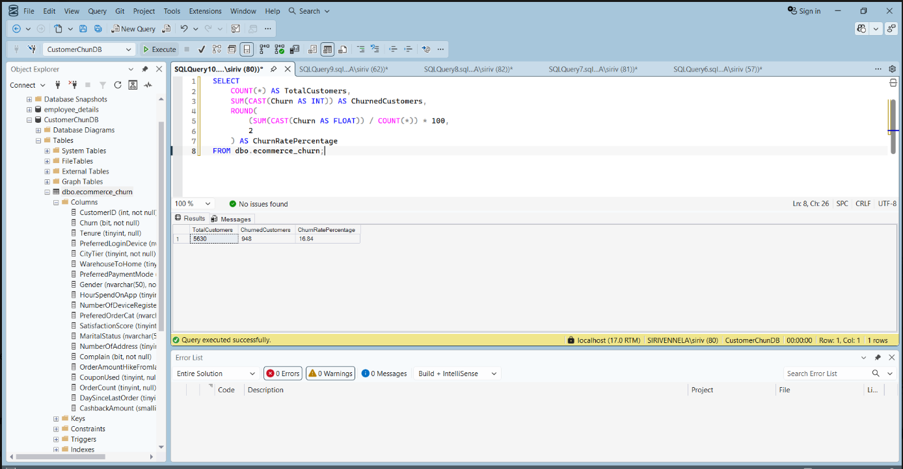
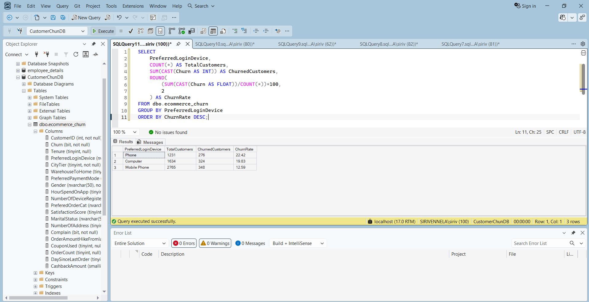
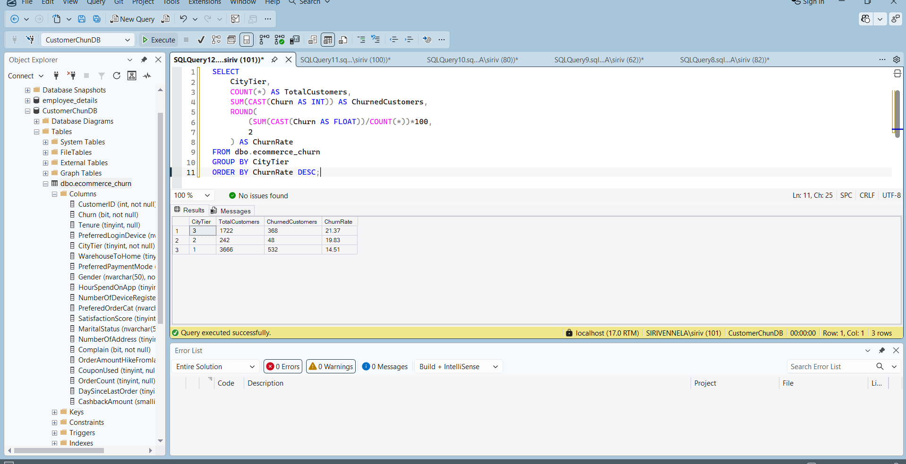
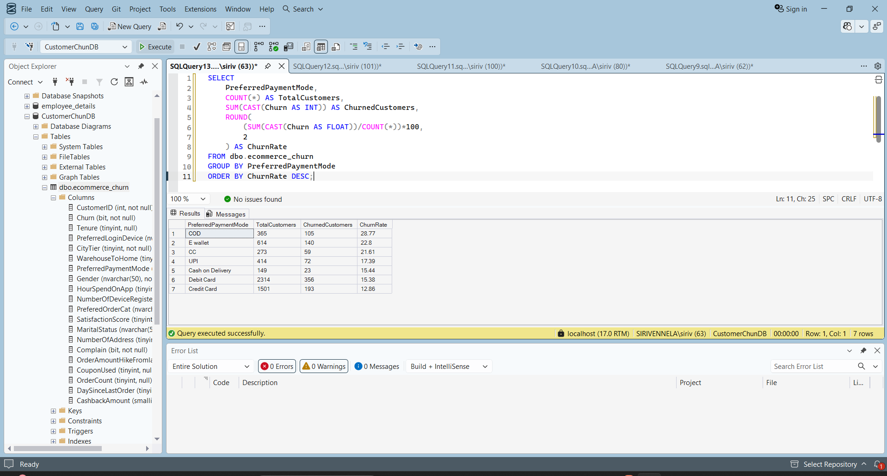
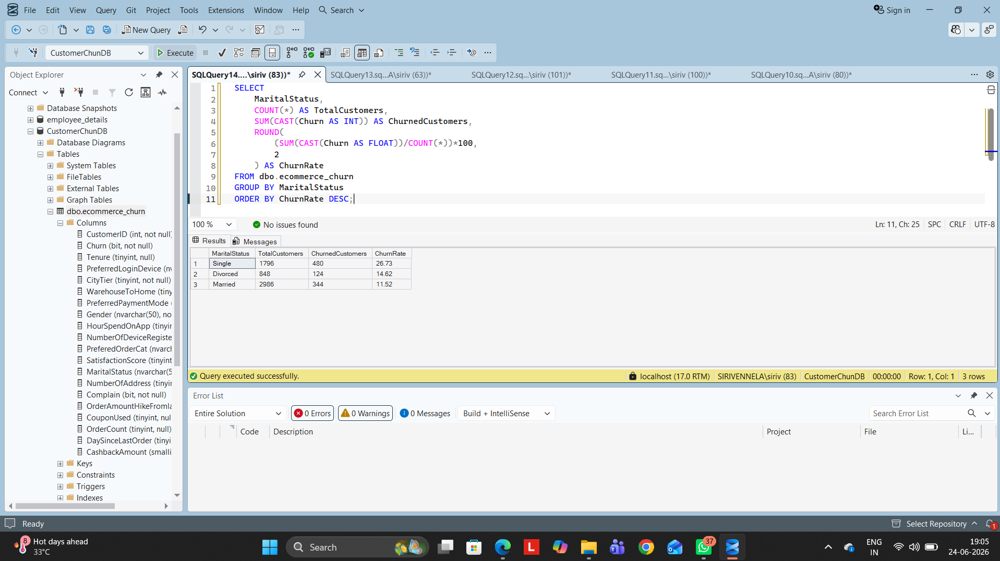

# E-Commerce-Customer-Churn-Analysis-SQL
SQL Server project analyzing customer churn behavior in an e-commerce platform.

## Project Overview

This project analyzes customer churn behavior in an e-commerce platform using SQL Server. The objective is to identify key factors influencing customer attrition and generate actionable business insights to improve customer retention.

## Dataset Information

- Total Customers: 5,630
- Churned Customers: 948
- Overall Churn Rate: 16.84%

## Tools Used

- SQL Server Management Studio (SSMS)
- SQL Server
- GitHub

## SQL Concepts Used

- Aggregate Functions
- GROUP BY
- ORDER BY
- CASE Statements
- Data Cleaning
- Data Exploration
- Business Analysis Queries

## Business Questions Answered

### 1. What is the overall customer churn rate?

**Result**

- Total Customers: 5630
- Churned Customers: 948
- Churn Rate: 16.84%

---

### 2. Which login device has the highest churn rate?

**Result**

| Device | Churn Rate |
|----------|----------|
| Phone | 22.42% |
| Computer | 19.83% |
| Mobile Phone | 12.59% |

**Insight**

Phone users show the highest churn behavior.

---

### 3. Which city tier has the highest churn rate?

| City Tier | Churn Rate |
|-----------|-----------|
| Tier 3 | 21.37% |
| Tier 2 | 19.83% |
| Tier 1 | 14.51% |

**Insight**

Customers from Tier 3 cities are more likely to churn.

---

### 4. Which payment mode has the highest churn rate?

| Payment Mode | Churn Rate |
|-------------|-----------|
| COD | 28.77% |
| E Wallet | 22.80% |
| Credit Card | 12.86% |

**Insight**

COD users show significantly higher churn compared to digital payment users.

---

### 5. How does marital status impact churn?

| Marital Status | Churn Rate |
|---------------|-----------|
| Single | 26.73% |
| Divorced | 14.62% |
| Married | 11.52% |

**Insight**

Single customers are more likely to leave the platform.

---

## Key Findings

- Overall churn rate is 16.84%.
- Phone users have the highest churn rate.
- Tier 3 cities experience the highest customer attrition.
- COD users churn more frequently than digital payment users.
- Single customers show the highest churn behavior.

## Business Recommendations

- Improve engagement for phone users.
- Strengthen retention programs in Tier 3 cities.
- Promote digital payment methods through offers and rewards.
- Design personalized campaigns for single customers.
- Enhance customer loyalty initiatives.

## Author

Siri Vennela
